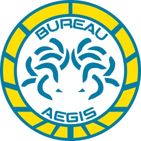
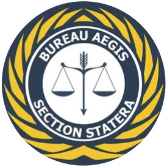
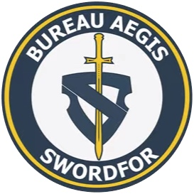

# Бюро Эгида

Сфера полномочий Бюро Эгида технически относится к юридическим вопросам. Однако понимание того, что считать "юридическим вопросом" в О-12 - организации, фактически заслужившей свой авторитет судебной экстраполяцией правовой сферы - отличается от общепринятого, и на практике Бюро Эгида служит исполнительным органом правительства.

В этой роли Бюро Эгида, кардинально отличаясь от других бюро, разделилось на почти независимые друг от друга секции: Секция Статера (назван в честь лат. - "баланс") и Секция Спата (длинный обоюдоострый римский меч, который был символом Справедливости).

> Разделённая Эгида.
> Верхняя Палата периодически пытается отделить Секцию Статера и/или Секцию Спата, фактически создав новое Бюро и разорвав полномочия Бюро Эгида. Ни одно из таких предложений не увенчалось успехом, а ведущие теоретики заговора предполагают, что Бюро Эгида затыкает всем рот (или, в более диких теориях, что Бюро Эгида, в действительности, является теневым правительством, тянущим марионеточные струны О-12).

## Секция Статера

Секция Статера является юридическим отделением Бюро Эгида. Оно отвечает за функционирование и содействие судам Консилиума, включая Верховный суд, и в основном состоит из огромного числа юристов, которых поддерживает настоящая армия государственных служащих.

## Секция Спата

Так же называемая Военными Силами О-12, Секция Спата состоит из тактического подразделения полиции, очень небольшой армии и значительного флота. Внутри этот раздел иногда в шутку называют «Команда эскалации»: Бюро поручено обеспечивать исполнение решений судов Консилиума, и, когда Секция Статера не может претворить в жизнь эти решения, Спата делает для этого всё возможное.

Однако, перед лицом вторжения Объединенной Армии институционная культура и миссия Спаты быстро меняется. Фразы типа «защита человечества» внезапно становятся гораздо менее ироничными и гораздо более буквальными.

## Подразделение Пси

Подразделение Пси - это военная разведка О-12. Хотя технически оно является частью Секции Спата, подразделение выросло до значительных размеров и работает с большой автономией (с во многом независимым командованием).

## Бюро Эгида. Задачи прикомандирования:

* Сбор военной оперативной информации от гражданских целей.
* Координирование тайных операций.
* Тайные операции.
* Обеспечение безопасности объектов О-12.
