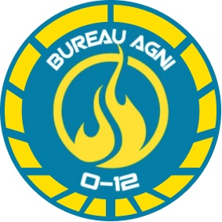

# Бюро Агни́

Бюро Агни́ отвечает за мониторинг, контроль поставок, распределение и регулирование энергии. Этот перечень видов деятельности непреднамеренно привел Бюро Агни к ответственности за торговлю тезием, прежде чем его жизненно важное значение в космической гонке было полностью раскрыто. Это, в свою очередь, привело Бюро к участию в работе с другими неоматериалами, сделав его особенно интересным для многих корпораций и стран.

## Секция Мети́да

Когда-то небольшое регулирующее агентство, Бюро Агни увеличилось в размерах в результате работы Секции Метида, которая занимается исследованиями и разработками. Базируясь в Хуачяо (Huaquiao), Метида управляет некоторыми из самых передовых и уважаемых физических лабораторий и исследовательских центров в Сфере Человечества, тесно сотрудничая с Бюро Тот и АЛЕФ по экспериментальным технологиям.
Помимо выполнения исследовательских проектов, Секция Метида также отвечает за мониторинг технологических разработок во всей Сфере Человечества.

## Бюро Агни́. Задачи прикомандирования:

* Анализ высокотехнологичных исследований.
* Уничтожение опасных опытно-конструкторских разработок.
* Захват ценных технологий.
* Проникновение или наблюдение за исследовательскими объектами.
* Отслеживание утечек из базы разработок Секции Метида.
