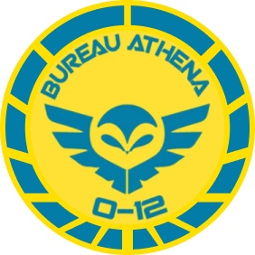

# Бюро Афина

Бюро Афина было создано служить трём фундаментальным целям:
1. Распространение культуры на международной арене.
2. Защита прав человека.
3. Оценка этических и религиозных проблем.

В этом последнем качестве Бюро Афина служит краеугольным камнем религиозной организации Сферы Человечества и O-12 (часто служа связующим звеном со своими представителями в Сенате O-12).

---
> Понимание союзников.
> Бюро Афина часто служит мешком для битья реакционным политикам, которые высмеивают его за поддержку «потерянных дел», таких как кампания Неотерранской ассоциации гражданских прав за права доступа «Атек». Однако в последнее время его звезда восходит, потому что культурные полномочия сделали Бюро основной точкой контакта между O-12 и Тохаа. Бюро недавно выпустило «Словарь терминов Тохаа» - результат шести месяцев интенсивных исследований.
---

## Секция Клио

Секция Клио, основанная в Университете Мангейма, отвечает за анализ и подготовку всеобъемлющей энциклопедической информации по всем аспектам Сферы Человечества и за ее пределами. Часто проводя исследования по поручению других бюро и организаций, Секция Клио является летописцем древней и новейшей истории. Их расследования текущих событий и местоположений часто требуют, чтобы они работали в тесном контакте с Бюро Тианди и другими бюро, но Секции Клио однозначно запрещено работать с Бюро Нуар, чтобы создать экран между мрачной целесообразностью тайных операций и принципиальным поиском истины.

## Бюро Афина. Задачи прикомандирования:

* Расследование злоупотреблений в отношении культурных меньшинств.
* Защита исчезающих или находящихся под угрозой исчезновения видов.
* Тайная охрана культурной экспедиции в Тохаа.
* Взлом корпоративных баз данных для доказательства нарушений прав человека.
* Предоставление информации о возможных нарушениях Конвенции Консилиума.
