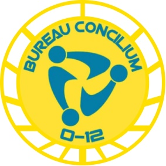

# Бюро Консилиум

Бюро Консилиум является правительственным органом, задачей которого является управление системой Консилиум. Это бюро управляет так называемыми «Свободными городами», расположенными в юрисдикции международного права и управления, такими как Свободный Город Иерусалим и "End of the Line Free Orbital" в системе Край Человечества.

## Бюро Консилиум. Задачи прикомандирования:

* Обеспечение правопорядка в свободных городах.
* Расследование терроризма на Консилиум Прайм.
* Борьба с браконьерами на Консилиум Прайм.
* Наблюдение за деятельностью гиперкорпораций в системе Консилиум.
* Расследование гражданской коррупции.