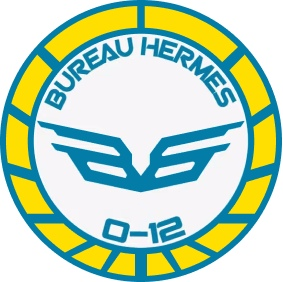

# Бюро Гермес

Гермес был основан для практического менеджмента торговли (лицензирование судов, регулирование процедур космодромов, администрирование зон свободной торговли и т. п.). В этой роли Гермес стал отвечать за строительство и управление прыжковыми воротами, а затем и циркулярами. Кроме того, бюро также занимаются созданием и сертификацией физической и квантовой инфраструктуры связи Сферы Человечества, в частности устройств передачи данных в прыжковых воротах, которые обеспечивают межсистемную связь.

В результате Бюро Гермес является одним из самых влиятельных бюро.
Однако, недавно были предприняты усилия - как внутри, так и за пределами О-12 - чтобы ограничить полномочия Бюро Гермес. Примечательно, что Гермес был вынужден создать корпорацию TransEtherea для управления деловой частью циркуляров. Хотя TransEtherea и предназначена для «большей экономической свободы», на практике она увеличила прибыль O-12, одновременно позволяя ему работать независимо от официальных каналов.

Также на Бюро Гермес были наложены финансовые ограничения. Ю Чин и ПанОкеания использовали «продолжающуюся нехватку персонала O-12», чтобы оправдать навязывание собственной безопасности циркулярам (в форме Рыцарей Сантьяго и Имперской Службы). Хотя технически они под юрисдикцией групп безопасности Бюро Эгида, трения между различными силами безопасности сильны. Бюро Гермес продолжает настаивать на более значительном распределении средств и персонала, с тем чтобы внешнее военное присутствие могло быть выведено из циркуляров.

## Бюро Гермес. Задачи прикомандирования:

* Расследование саботажа коммуникационной сети Сферы Человечества.
* Усиление операций по обеспечению безопасности Бюро Эгиды в Циркулярах.
* Расследование контрабанды через Циркуляры.
* Отслеживание проникновений Объединенной Армии через прыжковые врата.
* Шпионаж на торговых конференциях.
