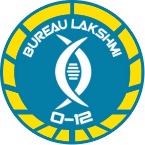

# Бюро Лакшми

Перечень видов деятельности Бюро Лакшми включает в себя все вопросы здоровья человека, включая распределение лекарств, программы вакцинации и медицинские исследования. Первоначально являвшаяся в основном гуманитарной организацией, по мере распространения технологий основанных на Шёлке, быстро расширив (впервые столкнулись с инопланетянами) определение «человек», Лакшми пришлось столкнуться с некоторыми из самых сложных технологических вопросов Нового календаря. В координации с АЛЕФ бюро также управляет банком Кубов и национальными программами Воскрешения.

## Бюро Лакшми. Задачи прикомандирования:

* Восстановление куба.
* Пресечение незаконных операций по Воскрешению.
* Защита жертв незаконных медицинских экспериментов.
* Расследование биомедицинской контрабанды.
* Доставка медикаментов в опасные регионы.