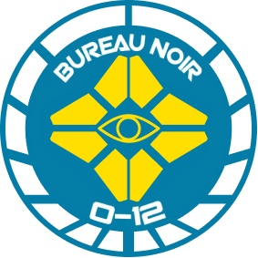

# Бюро Нуар

Бюро Нуар - это секретная служба О-12, отвечающая за сбор, анализ и использование информации на благо Человечества. Хотя небольшая основная структура Бюро функционирует как комплексное разведывательное агентство, основная часть его аппарата предназначена для гибкого удовлетворения потребностей разведывательных служб других бюро. В процессе исполнения своих функций, другие бюро могут эффективно реквизировать ресурсы Бюро Нуар для выполнения необходимых операций. Кроме того, Бюро Нуар информирует другие бюро о критически важных сведениях через бюллетени "Noir Alert Bulletins" (NAB).

## Структура управления

Командная цепочка Бюро Нуар фактически разбита на две отдельные организации. Во-первых, есть офицеры. Каждый офицер имеет особую юрисдикцию - город, регион, планету, солнечную систему - и обслуживается персоналом общественной поддержки. Их работа заключается в том, чтобы поддерживать объекты и ресурсы Нуар в пределах своей юрисдикции, координировать действия с местными правоохранительными органами и правоохранительными органами Эгиды, создавать регулярные отчеты (которые можно отфильтровать в NAB) и в целом координировать местную деятельность. Они контролируют примерно 95% персонала Бюро Нуар, концентрируясь на менее захватывающей работе по сбору, анализу и проектированию данных.

Однако они обычно не управляют отдельными агентами. Эта работа выполняется независимыми кураторами, большинство из которые работают в разных юрисдикциях (отвечая на запросы командующих офицеров, других бюро и Генерального совета, а также Верхней Палаты, Малой Ассамблеи и Судов Консилиума).

> В 66 г.н.в. Кочевники представили в Совет безопасности O-12 доказательства того, что некие наемники были пойманы при попытке украсть информационные базы данных, которые могли бы идентифицировать личные дела сотрудников Бюро Нуар и Бюро Тот. Они утверждали, что АЛЕФ незаконно спонсировал эту акцию. Агент Бюро Нуар, ответственный за расследование, был убит при разрушении Орбитальной станции "EveningStar", а дикие претензии Кочевников были отклонены как не более чем их типичная истерия.

## Чёрные книги

Бюро Нуар работает в сильно сегментированной структуре, которая окутана тайной. Даже АЛЕФ не может точно знать, как устроено Бюро или кто является членами высшего ранга, и только у этих теневых высших чинов есть разрешение на доступ к полному кадровому архиву агентства. Но даже у них нет полной картины, потому что большинство кураторов уполномочены (официально или неофициально) вести «черную книгу» - набор агентов, контактов и других ресурсов, которые не известны основной организации.
Черные книги помогают гарантировать институциональную безопасность, но они также облегчают отрицание ответственности за те или иные действия. (Конечно, существует также риск мошенничества. Но риск стоит выгоды.)

## Постановка задачи

Как только куратор получает назначение, он комплектует миссию набором агентов, которыми он управляет (некоторые предпочитают поддерживать давние команды, часто работающие вместе; другие смешивают и подбирают любой персонал, который лучше всего подходит - и доступен! - для текущей работы).

Инструктаж агентов может принимать несколько разных форм. Среди некоторых команд распространены прямые встречи лицом к лицу. Какие-то кураторы предпочитают анонимность, предлагаемую квантовыми виртуальными пространствами. Некоторые задания на миссии даются через подставные почтовые адреса.
Брифинги для миссий почти всегда включают в себя пакет эксплуатационных параметров (operational parameters packet - OPP), который включает контакты, безопасные дома и другие местные ресурсы, которые можно использовать в случае чрезвычайных ситуаций.

> Noirsign - это система специальных сигналов, жестов рук и кодовых фраз, которые агенты Нуар могут использовать для идентификации и, в ограниченной степени, общения друг с другом. Члены сети конкретного куратора часто разрабатывают свой уникальный жаргон.

## Агенты

Большинство бюро O-12 набирают своих членов из престижных университетов Консилиума. Бюро Нуар, с другой стороны, примечательно тем, что многие его агенты набираются с низов: многие агенты вступают в Бюро после того, как их впутывает в операции «Нуар» или их набирают, в основном, с улицы, потому что у них есть необходимый набор навыков для конкретной миссии.

Это также означает, что в Бюро Нуар имеется большое количество агентов иностранного происхождения по сравнению с другими проконсилиумными бюро. Фактически, многие из агентов «черной книги», на самом деле являются агентами по контракту: они никогда не давали клятву гражданства O-12, не несут официальный значок «Бюро Нуар», и действуют как внештатные агенты или наемники.

> No contact.
> Агенты Бюро Нуар мало общаются с основной организацией, за исключением их куратора. Агентам, которые были «оставлены на морозе», то есть потеряли связь со своими кураторами, обычно дают протоколы для установления контакта с командирами, позволяющие им либо восстановить связь со своим куратором, либо быть назначенными в портфолио другого.

Противоречивость состава Бюро Нуар еще больше усилилась после вторжения в Парадизо. В целях удовлетворения растущего спроса на разведывательные данные Бюро Нуар в рамках инициативы «Amikeco» ("Дружба", эсперанто - прим.пер.) непосредственно набирало специалистов из спецслужб государств-членов.

Эта системная путаница придает Бюро прочную, практическую выносливость и большой запас уникальных ресурсов, которые можно использовать. Но это также означает много проблем с лояльностью и потенциальных конфликтов интересов
