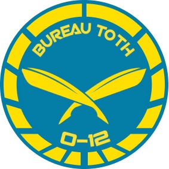

# Бюро Тот (Toth)

Бюро Тот, отвечающее за надзор, поддержку и обслуживание АЛЕФ, является крупнейшим и наиболее скрытным из бюро O-12. Его бюджет, штатное расписание и точные рабочие директивы неизвестны даже АЛЕФ.
Или, по крайней мере, это то, во что хотелось бы верить. В действительности даже случайные наблюдатели знают, что многие из самых многообещающих инженеров данных и программистов ИИ в Сфере Человечества исчезают в Бюро Тот.

Помимо управления АЛЕФ, Бюро Тот обеспечивает техническую поддержку и надзор Секции по особым ситуациям АЛЕФ по обеспечению соблюдения Закона об ИИ.

## Бюро Тот. Задачи прикомандирования:

* Поддержка операций отслеживания незаконных ИИ.
* Работы по мониторингу загадочного поведения АЛЕФ.
* Выслеживание узлов EI.
* Наблюдение за расследованиями нарушений гиперкорпорациями Закона об единственном ИИ.
