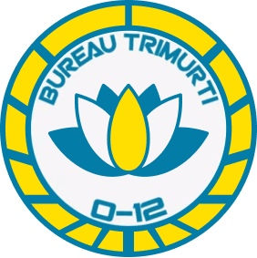

# Бюро Триму́рти

Бюро Тримурти является первичной вспомогательной инфраструктурой Генерального совета для координации и взаимодействии между бюро О-12 (включая внутренние расследования) В его компетенцию также входят дипломатия и международные отношения - выступление в качестве основного представителя O-12, защита его публичного имиджа и управление присутствием в Maya и социальных сетях.

## Задачи прикомандирования Бюро Триму́рти:

* Помощь в расследовании коррупции в Эдде.
* Возвращение украденных конфиденциальных данных O-12.
* Скрытное обеспечение безопасности для дипломатических конференций.
* Курьерская доставка секретной информации.
* Мониторинг, высказываний об O-12 в подпольных инфранетах.
